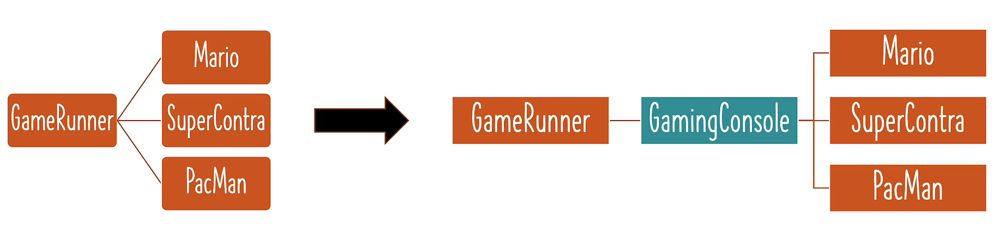

# Step 02 - Getting Started with Java Spring Framework

## Tightly Coupled Java Code

- GameRunner class
- Game classes: Mario, SUperContra, Pacman etc

## What is Tight Coupling and loose coupling

- Coupling: How much work is involved in changing something
- You need to change the GameRunner class to change to another game
- we want loose coupling as much as possible

## Using Interfaces for loose coupling

- gameRunner class is disconnected from games
- it is only connected to the interface
