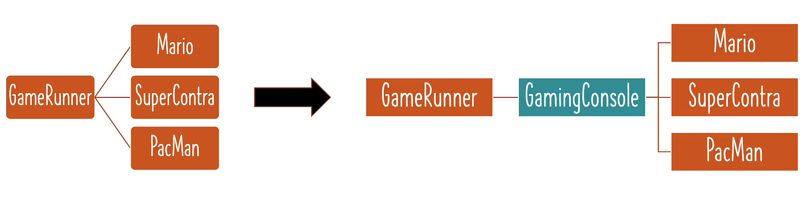
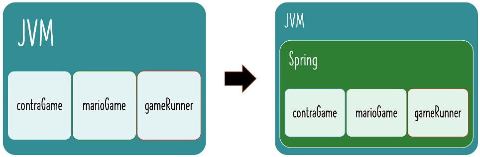
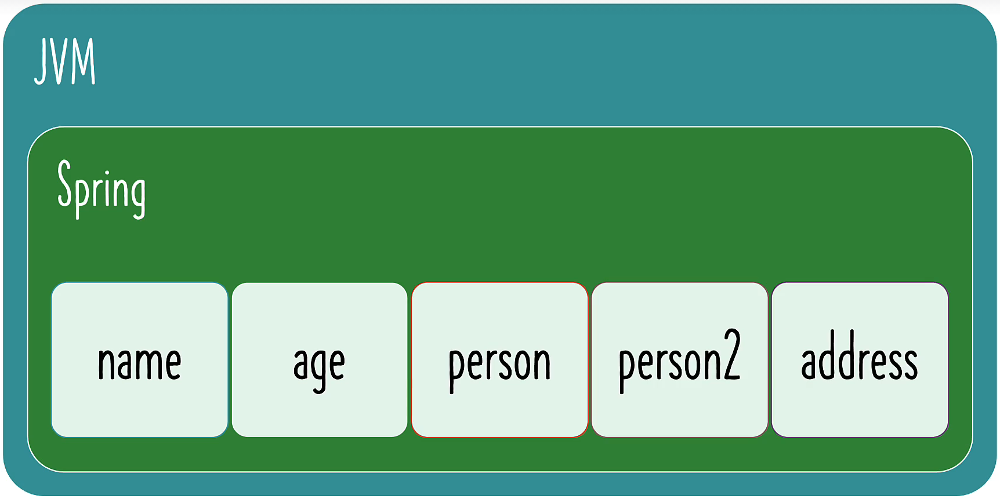

# Section 2

## Tightly Coupled Java Code

- GameRunner class
- Game classes: Mario, SUperContra, Pacman etc

## What is Tight Coupling and loose coupling

- Coupling: How much work is involved in changing something
- You need to change the GameRunner class to change to another game
- we want loose coupling as much as possible

## Using Interfaces for loose coupling



- gameRunner class is disconnected from games
- it is only connected to the interface

## Wiring Dependencies using SPRING framework



### Simple example

- Creating a spring context with spring beans

  - Spring beans: things that are managed by Spring



- Configure the things that we want Spring to manage - "@Configuration" annotated class
  - HelloWorldConfiguration class has "@Bean" annotated methods that produce beans
  - default name of Bean is the name of the "@Bean"method
  - add an attribute to annotation for custom name
    - ```@Bean(name = "customName")```

- Launch a Spring Context
  - ```var context = new AnnotationConfigApplicationContext(HelloWorldConfiguration.class);```
  
- Retrieving Beans managed by Spring
  - ```context.getBean(nameofBean);```
  - ```context.getBean(typeofBean);```
    - ex) ```context.getBean(Address.class);```
  
## Implementing Auto Wiring in Spring Framework Java Configuration File

- Using existing Beans managed by spring to create a new Bean
  - Method 1 - Using method calls
    - use the method of existing beans
  ```Java
  @Bean
  public Person person2MethodCall() {
    return new Person(name(), age(), address());
  }
  ```
  - Method 2 - Using Parameters
    - give the type and name of bean as a parameter of the newly created bean
  ```Java
  @Bean
  public Person person3Parameters(String name, int age, Address address3) {
    return new Person(name, age, address3);
  }
  ```