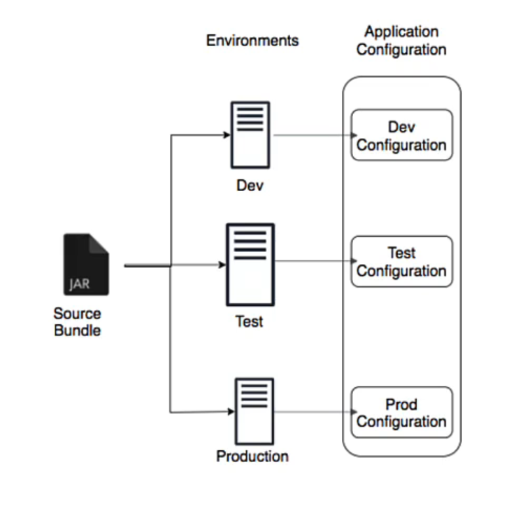

# section5

## Before Spring Boot

Dependency management(pom.xml): manage frameworks and versions  
web.xml
Spring Configurations
NFRs : Non Functional Requirements

## Most Important Goal of Spring Boot

helps build PRODUCTION READY apps QUICKLY

-   QUICK
    -   Spring Initializr
    -   Spring Boot Starter Projects
    -   Spring Boot Auto Configuration
    -   Spring Boot DevTools
-   PRODUCTION READY
    -   Logging
    -   Different Configuration for Different Environments
        -   Profiles, ConfigurationProperties
    -   Monitoring (Spring Boot Actuator)

## Spring Boot Starter Projects

Starters: Convenient dependency descriptors for different features

-   Web Application & REST API - Spring Boot Starter Web (spring-webmvc, spring-web, spring-boot-starter-tomcat, spring-boot-starter-json)
-   Unit Tests - Spring Boot Starter Test
-   Talk to database using JPA - Spring Boot Starter Data JPA
-   Talk to database using JDBC - Spring Boot Starter JDBC
-   Secure your web application or REST API - Spring Boot Starter Security

## Spring Boot Auto Configuration

A typical Spring app needs a lot of configuration

Simplifying: Auto Configuration

-   Decided based on:
    -   Which frameworks are in the Class Path?
    -   What is the existing configuration (Annotations etc)?

Example: Spring Boot Starter Web

-   Dispatcher Servlet (DispatcherServletAutoConfiguration)
-   Embedded Servlet Container - Tomcat is the default (EmbeddedWebServerFactoryCustomizerAutoConfiguration)
-   Default Error Pages (ErrorMvcAutoConfiguration)
-   Bean<->JSON (JacksonHttpMessageConvertersConfiguration)

## Spring Boot DevTools

add `spring-boot-devtools` to pom.xml dependency  
(needs a few setting changes to work in Intellij IDEA)

Increase developer productivity  
Automatic restart of server for code change

Remember: For pom.xml dependency changes, you will need to restart server manually

## Spring Boot PRODUCTION-READY

### Managing App. Configuration using Profiles

Applications have different environments
Dew, QA, Stage, Prod,...
Different environments need different configuration:

-   Different Databases
-   Different Web Services
-   ...

Profiles: profides Environment specific configurations



### Defining Properties per Profile

Spring looks for property (or YAML) files in the format:

-   `application.properties` → **common settings** (applied everywhere unless overridden)
-   `application-dev.properties` → used only when `dev` profile is active
-   `application-test.properties` → used only when `test` profile is active
-   `application-prod.properties` → used only when `prod` profile is active

Same rule applies to YAML:

-   `application-dev.yml`
-   `application-prod.yml`

### Hierarchy & Override Rules

-   Spring first loads **application.properties**
-   Then, it loads **application-{profile}.properties**
-   Profile-specific values **override** the defaults

### Activating Profiles

You can activate a profile in several ways:

-   **application.properties**

    ```properties
    spring.profiles.active=dev
    ```

-   **Command line**

    ```
    java -jar app.jar --spring.profiles.active=prod
    ```

-   **Environment variable**

    ```
    SPRING_PROFILES_ACTIVE=prod
    ```

#### Activating Multiple Profiles

You can activate more than one profile at the same time:

```properties
spring.profiles.active=dev,local
```

-   Both `application-dev.properties` and `application-local.properties` will be loaded
-   If the same property exists in both, the **last one wins**

## @ConfigurationProperties

`@ConfigurationProperties` maps **a whole group of related properties** into a Java class.

### Example

#### `application-dev.properties`

```properties
app.datasource.url=jdbc:h2:mem:testdb
app.datasource.username=sa
app.datasource.password=password
```

#### Java config

```java
@Component
@ConfigurationProperties(prefix = "app.datasource")
public class DataSourceProperties {
    private String url;
    private String username;
    private String password;

    // getters & setters
}
```

Now Spring automatically binds:

-   `app.datasource.url` → `url`
-   `app.datasource.username` → `username`
-   `app.datasource.password` → `password`

### Profiles + @ConfigurationProperties

#### `application-dev.yml`

```yaml
app:
    datasource:
        url: jdbc:h2:mem:testdb
        username: sa
        password: devpass
```

#### `application-prod.yml`

```yaml
app:
    datasource:
        url: jdbc:mysql://prod-db:3306/app
        username: prod_user
        password: prodpass
```

#### Java config (shared)

```java
@Component
@ConfigurationProperties(prefix = "app.datasource")
public class DataSourceProperties {
    private String url;
    private String username;
    private String password;
    // getters & setters
}
```

When profile = `dev`, Spring fills the object with **H2 in-memory DB** values.  
When profile = `prod`, Spring fills it with **MySQL production DB** values.  
=> Same class, different values depending on profile.

## Embedded Servers

WAR approach of deploying application?

-   1 : Install Java
-   2 : Install Web/Application Server (Tomcat/WebSphere/WebLogic etc)
-   3 : Deploy the application WAR (Web ARchive)
    -   This is the OLD WAR Approach
    -   Complex to setup!

Embedded Server - Simpler alternative

-   1 : Install Java
-   2 : Run JAR file
-   Make JAR not WAR (Credit: Josh Long!)
-   Embedded Server Examples:
    -   spring-boot-starter-tomcat
    -   spring-boot-starter-jetty
    -   spring-boot-starter-undertow

## Spring Boot Actuator

Monitor and manage application in production  
provides a number of endpoints

-   beans - Complete list of Spring beans in your app
-   health - Application health information
-   metrics - Application metrics
-   mappings - Details around Request Mappings
-   etc

default is health only  
must add `management.endpoints.web.exposure.include=*` for other endpoints
-> gathering all the endpoint take time memory cpu. specify needed
