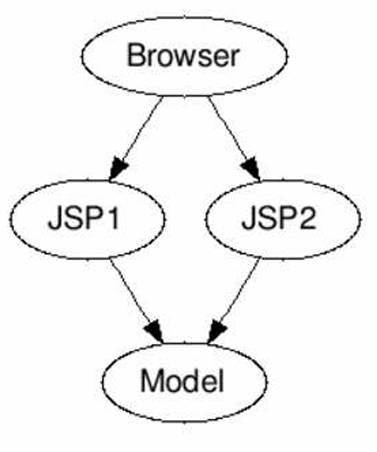
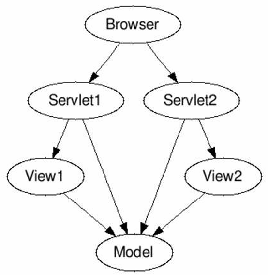
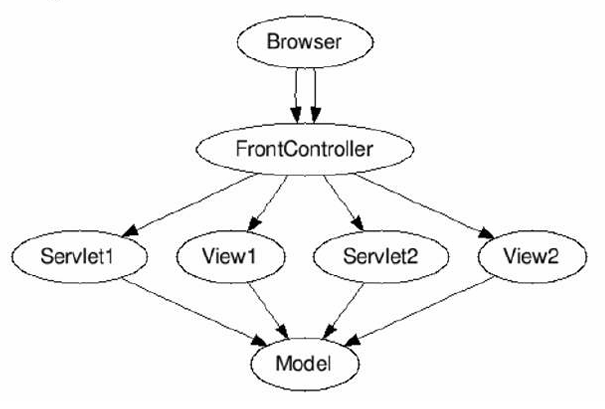

# section 6

## Making a todo website

Build Todo Management Web App
with a Modern Spring Boot Approach

## initialize

use Spring initializr => https://start.spring.io/  
import project to IDE

> when using Intellij and Spring devtools:
>
> -   Build, Exeution, Deployment > Compiler > Build project autiomaically 체크
> -   Advanced Settings > Allow auto-make to start even if developed application is currently running 체크

## Spring boot project Important files

src-> main -> java-> package -> Application.java file => launches app

resources -> application.properties => configure app details(ex : `server.port=8081`)

pom.xml => define all dependancys related to application

## first Spring MVC controller, @ResponseBody, @Controller

@Controller : Marks the class as a Spring MVC controller so that Spring can detect it during component scanning and use it to handle web requests(special type of component)

@RequestMapping("/name") : Maps HTTP requests with the URL path /name to the annotated method (or class)

@ResponseBody : Tells Spring that the return value of the method should be written directly to the HTTP response body, instead of being interpreted as a view name

## Redirect to a JSP using Spring Boot - Controller, @ResponseBody and View Resolver

JSP files should go in : `/src/main/resources/META-INF/resources/WEB-INF/jsp/`

Add following to `application.properties`

```
spring.mvc.view.prefix=/WEB-INF/jsp/
spring.mvc.view.suffix=.jsp
```

> `logging.level.org.springframework=debug` for debugging

must add following to `pom.xml`

    <dependency>
    	<groupId>org.apache.tomcat.embed</groupId>
    	<artifactId>tomcat-embed-jasper</artifactId>
    </dependency>

### flow

1. request to /url
2. @Controller -> mapped method(@RequestMapping) handles request => returns name of jsp
3. Spring View Resolver(configured in application.properties) -> adds prefix and suffix to name of jsp
4. request is redirected to jsp

## Capturing QueryParams using RequestParam and First Look at Model

queryParams : method to pass info to url
=> `url?param=info`

using queryParams : `@RequestParam String name`

ModelMap : passes params from method to view
=> `ModelMap model`

## Logging

Specify logging level in `application.properties`

can specify: package name, file name

```Java
 logging.level.some.path=debug
 logging.level.some.other.path=error
 logging.file.name=logfile.log
```

### adding logs

`Logger logger = LoggerFactory.getLogger(getClass());`
=> can specify logging level -> `logger.debug("Request param is {}", name);`

```Java
 private Logger logger = LoggerFactory.getLogger(this.getClass());
 logger.info("postConstruct");
```

-   Spring Boot makes logging easy
    -   spring-boot-starter-logging
-   Default: Logback with SLF4j
-   Typical Log Levels: ERROR, WARN, INFO, DEBUG, or TRACE

## DispatcherServlet, Model 1, Model 2 and Front Controller

### Model 1 Architecture



ALL CODE in Views (JSPs, ...)

-   View logic
-   Flow logic
-   Queries to databases

Disadvantages:

-   VERY complex JSPs
-   ZERO separation of concerns
-   Difficult to maintain

### Model 2 Architecture



Seperating concerns

-   Model: Data to generate the view
-   View: Show information to user
-   Controller: Controls the flow

Adavantage: Simpler to maintain

Concern: Hard to implement common features to all controllers

### Model 2 Architecture - Front Controller



Concept: All requests flow into a central controller => Front Controller

Front Controller controls flow to Controller's and View's  
=> Common features can be implemented in the Front Controller

## Spring MVC Front Controller - Dispatcher Servlet

-   **A:** Receives HTTP Request

-   **B:** Processes HTTP Request

    -   **B1:** Identifies correct Controller method
        -   Based on request URL
    -   **B2:** Executes Controller method
        -   Returns Model and View Name
    -   **B3:** Identifies correct View
        -   Using ViewResolver
    -   **B4:** Executes view

-   **C:** Returns HTTP Response

## get vs post

```
	<form method="post">
	  Name: <input type="text" name="name">
	  Password: <input type="password" name="password">
	  <input type="submit">
	</form>
```

| Aspect              | **GET**                                                                 | **POST**                                                      |
| ------------------- | ----------------------------------------------------------------------- | ------------------------------------------------------------- |
| **Purpose**         | Retrieve data from the server                                           | Send data to the server (often to create or update resources) |
| **Data Location**   | Appended to the URL as **query parameters** (e.g., `?name=John&age=20`) | Sent in the **request body**                                  |
| **Visibility**      | Visible in the browser address bar (bookmarkable & shareable)           | Hidden from URL (not bookmarkable directly)                   |
| **Data Size Limit** | Limited by URL length (around 2–8 KB depending on browser/server)       | Can send much larger payloads (files, JSON, forms)            |
| **Caching**         | Can be cached by browsers and proxies                                   | Typically not cached (unless explicitly specified)            |
| **Use Cases**       | - Search queries                                                        |                                                               |

using POST form data : `@RequestParam String name`

## hardcoding ID, password authentication

> IDEAL: use spring security

add components with business logic with annotation : @Service

## Request vs Model vs Session

### 요청(Request)

-   **정의**: 사용자가 브라우저에서 보낸 입력 데이터가 서버에 전달될 때 하나의 요청(Request)이 생성됨.
-   **특징**

    -   요청은 **한 번의 요청-응답 사이클 동안만 유효**.
    -   응답이 끝나면 요청 속성은 **메모리에서 제거**됨.
    -   다음 요청에는 이전 요청의 데이터가 자동으로 포함되지 않음.

-   **사용 예시**

    -   로그인 폼에서 사용자 이름, 비밀번호 입력 → 서버로 전송 → 인증 처리 → 응답 반환 후 데이터 사라짐.

### 모델(Model)

-   **정의**: 컨트롤러에서 뷰로 데이터를 전달하기 위해 사용되는 객체.
-   **특징**

    -   컨트롤러에서 `model.addAttribute()`를 사용해 값 저장.
    -   모델의 값은 **현재 요청에서만 사용 가능**.
    -   다음 요청에서는 모델 데이터가 유지되지 않음.

-   **사용 예시**

    ```java
    @RequestMapping("/login")
    public String login(Model model) {
        model.addAttribute("name", "User");
        return "welcome";  // welcome.jsp에서 ${name}으로 접근 가능
    }
    ```

### 세션(Session)

-   **정의**: 여러 요청에 걸쳐 데이터를 유지하기 위한 서버 측 저장소.
-   **특징**

    -   클라이언트마다 고유한 세션 ID가 부여됨.
    -   세션에 저장된 데이터는 **브라우저를 닫거나 세션이 만료될 때까지 유지**.
    -   서버 메모리를 차지하므로 **필요한 최소한의 정보만 저장**하는 것이 권장됨.

-   **사용 예시**

    ```java
    @SessionAttributes("name")
    @Controller
    public class LoginController {
        @RequestMapping("/login")
        public String login(Model model) {
            model.addAttribute("name", "User"); // 세션에 저장
            return "welcome";
        }
    }
    ```

### Request Scope vs Session Scope

| 구분          | Request Scope                 | Session Scope                          |
| ------------- | ----------------------------- | -------------------------------------- |
| **유효 기간** | 단일 요청-응답 사이클         | 여러 요청 동안 유지                    |
| **저장 위치** | 메모리 (요청 종료 시 삭제)    | 서버 메모리 (세션 만료 시 삭제)        |
| **사용 목적** | 현재 요청에서만 필요한 데이터 | 로그인 사용자 정보 등 장기 유지 데이터 |
| **주의 사항** | 없음 (짧은 생명주기)          | 메모리 과다 사용 주의                  |

## JSTL

```xml
<dependency>
	<groupId>jakarta.servlet.jsp.jstl</groupId>
	<artifactId>jakarta.servlet.jsp.jstl-api</artifactId>
</dependency>

<dependency>
	<groupId>org.glassfish.web</groupId>
	<artifactId>jakarta.servlet.jsp.jstl</artifactId>
</dependency>
```

must use taglib to use JSTL tags  
=> `<%@ taglib prefix="c" uri="jakarta.tags.core" %>`  
-> refer to : https://docs.oracle.com/javaee/5/jstl/1.1/docs/tlddocs/c/tld-summary.html  
&nbsp;&nbsp; => ex: <c:forEach items="${todos}" var="todo">

## Adding Bootstrap CSS framework to Spring Boot Project using webjars

add two dependencies

```xml
		<dependency>
			<groupId>org.webjars</groupId>
			<artifactId>bootstrap</artifactId>
			<version>5.1.3</version>
		</dependency>
		<dependency>
			<groupId>org.webjars</groupId>
			<artifactId>jquery</artifactId>
			<version>3.6.0</version>
		</dependency>
```

In the jsp file link href from webjars/

```
webjars\bootstrap\5.1.3\css\bootstrap.min.css
webjars\bootstrap\5.1.3\js\bootstrap.min.js
webjars\jquery\3.6.0\jquery.min.js
```

-   head:
    `<link href="webjars\bootstrap\5.1.3\css\bootstrap.min.css" rel="stylesheet">`
-   end of body:
    `<script src= "webjars\bootstrap\5.1.3\js\bootstrap.min.js"></script>`
    `<script src= "webjars\jquery\3.6.0\jquery.min.js"></script>`

## Formatting JSP pages with Bootstrap CSS framework

recommended to put all content in `div` tag with a class called container

use classes that bootstrap can understand

## Redirecting requests

in method add:
`return "redirect:list-todos";`  
=> redirects to method with list-todos as @RequestMapping url, not a jsp with the naem list-todos

## Spring Boot Starter Validations

frontend validations(html & js) can be easily overwritten by hackers  
=> User serverside validations

Validations with Spring Boot

-   **1: Spring Boot Starter Validation**

    -   `pom.xml`
    -   ```xml
        <dependency>
        	<groupId>org.springframework.boot</groupId>
        	<artifactId>spring-boot-starter-validation</artifactId>
        </dependency>
        ```

-   **2: Command Bean (Form Backing Object)**
-   -   instead of using `@RequestParam` directly link it to a object
    -   use `spring form library` in jsp
        -   `<%@ taglib prefix="form" uri="http://www.springframework.org/tags/form" %>`
    -   must add a empty or pre-filled object into the model in get

    => 2-way binding (`todo.jsp` & `TodoController.java`)

    -   Concept : **bidirectional connection** between the view (JSP/Form) and the model (Command Bean) that allows exchanging values.
        -   **On GET request**: The object added to the model in the controller → automatically displayed in the view (e.g., `form:input` fields)
        -   **On POST request**: The values entered in the form → automatically mapped to the fields of the controller’s command object
    -   Flow
        1. **Controller (GET)**
            - Puts an empty or pre-filled object into the model (e.g. `model.addAttribute("todo", new Todo(...))`)
        2. **View (JSP)**
            - `<form:form modelAttribute="todo">` + `<form:input path="description"/>`
            - Automatically binds `todo.description` from the model to the input value
        3. **User fills the form and submits**
        4. **Controller (POST)**
            - Request parameters → matching fields (`setXxx`) → auto-populated `Todo` object
            - Optionally validated (`@Valid`) and processed with `BindingResult`

-   **3: Add Validations to Bean**

    -   `Todo.java`

-   **4: Display Validation Errors in the View**
    -   `todo.jsp`
